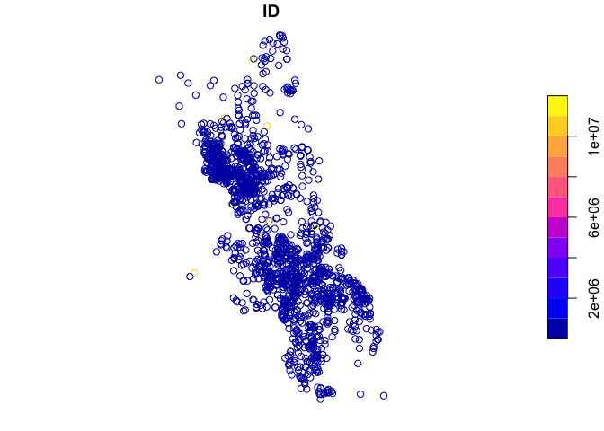
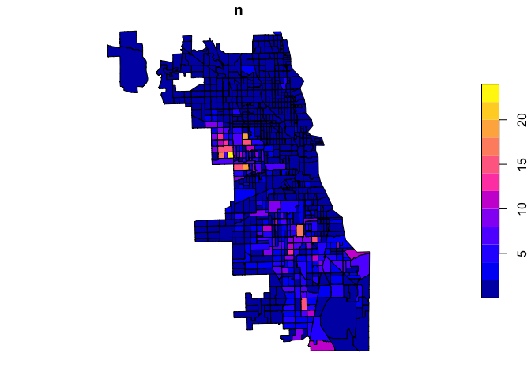
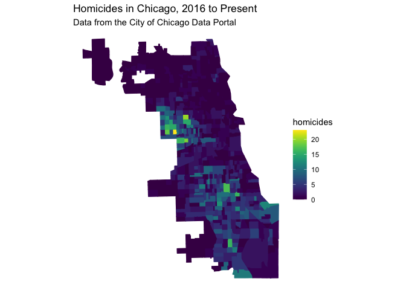

Chicago Homicide Distribution
================
Zhuo Lyu (Jessica)
08/02/2018

``` r
library(viridis)
library(tidyverse)
library(ggplot2)
library(tidycensus)
library(sf)
```

## R Markdown

This is an R Markdown document. Markdown is a simple formatting syntax
for authoring HTML, PDF, and MS Word documents. For more details on
using R Markdown see <http://rmarkdown.rstudio.com>.

When you click the **Knit** button a document will be generated that
includes both content as well as the output of any embedded R code
chunks within the document. You can embed an R code chunk like this:

``` r
crimes_fil<-read.csv("/Users/jessicalyu/R_HARRIS/crimes_filtered.csv")
dim(crimes_fil)
```

    ## [1] 9218   22

``` r
crimes_fil%>%
  group_by(Year)%>%
  count(Year)%>%
  filter(Year>=2013 & Year<=2018)
```

    ## # A tibble: 6 × 2
    ## # Groups:   Year [6]
    ##    Year     n
    ##   <int> <int>
    ## 1  2013   422
    ## 2  2014   426
    ## 3  2015   500
    ## 4  2016   783
    ## 5  2017   672
    ## 6  2018   304

``` r
crimes_fil<-crimes_fil%>%
  group_by(Year)%>%
  filter(Year>=2016 & Year<=2018)
dim(crimes_fil)
```

    ## [1] 1759   22

``` r
crimes_fil<- st_as_sf(crimes_fil,coords = c("Longitude", "Latitude"),crs = 4326,remove=FALSE)
glimpse(crimes_fil)
```

    ## Rows: 1,759
    ## Columns: 23
    ## Groups: Year [3]
    ## $ ID                   <int> 22451, 22452, 23810, 22533, 23128, 22453, 22454, …
    ## $ Case.Number          <fct> HZ250365, HZ249724, JB140548, HZ300435, JA149608,…
    ## $ Date                 <fct> 05/03/2016 09:08:00 PM, 05/03/2016 02:00:00 PM, 0…
    ## $ Block                <fct> 074XX S MAPLEWOOD AVE, 049XX W MONROE ST, 117XX S…
    ## $ IUCR                 <int> 110, 110, 110, 110, 110, 110, 110, 110, 110, 142,…
    ## $ Primary.Type         <fct> HOMICIDE, HOMICIDE, HOMICIDE, HOMICIDE, HOMICIDE,…
    ## $ Description          <fct> FIRST DEGREE MURDER, FIRST DEGREE MURDER, FIRST D…
    ## $ Location.Description <fct> STREET, STREET, STREET, STREET, ALLEY, YARD, STRE…
    ## $ Arrest               <fct> false, false, false, true, true, false, false, fa…
    ## $ Domestic             <fct> false, false, false, false, false, false, false, …
    ## $ Beat                 <int> 835, 1533, 524, 835, 1512, 214, 1235, 411, 532, 2…
    ## $ District             <int> 8, 15, 5, 8, 15, 2, 12, 4, 5, 2, 7, 6, 6, 10, 10,…
    ## $ Ward                 <int> 18, 28, 34, 18, 29, 4, 25, 5, 9, 3, 16, 6, 6, 24,…
    ## $ Community.Area       <int> 66, 25, 53, 70, 25, 38, 31, 45, 53, 38, 68, 44, 6…
    ## $ FBI.Code             <fct> 01A, 01A, 01A, 01A, 01A, 01A, 01A, 01A, 01A, 01B,…
    ## $ X.Coordinate         <int> 1160663, 1143598, 1172100, 1158664, 1137692, 1181…
    ## $ Y.Coordinate         <int> 1855290, 1899211, 1827003, 1848856, 1900424, 1877…
    ## $ Year                 <int> 2016, 2016, 2018, 2016, 2017, 2016, 2016, 2016, 2…
    ## $ Updated.On           <fct> 05/10/2016 03:56:50 PM, 05/10/2016 03:56:50 PM, 0…
    ## $ Latitude             <dbl> 41.75861, 41.87947, 41.68074, 41.74099, 41.88290,…
    ## $ Longitude            <dbl> -87.68675, -87.74820, -87.64566, -87.69425, -87.7…
    ## $ Location             <fct> "(41.758606301, -87.686748849)", "(41.879467146, …
    ## $ geometry             <POINT [°]> POINT (-87.68675 41.75861), POINT (-87.7482…

``` r
plot(crimes_fil["ID"])
```

<!-- -->

``` r
gdf<-st_read("/Users/jessicalyu/R_HARRIS/geo_export_de4e4434-d0da-4b22-97ae-b5d8724dd674.shp")
```

    ## Reading layer `geo_export_de4e4434-d0da-4b22-97ae-b5d8724dd674' from data source `/Users/jessicalyu/R_HARRIS/geo_export_de4e4434-d0da-4b22-97ae-b5d8724dd674.shp' 
    ##   using driver `ESRI Shapefile'
    ## Simple feature collection with 801 features and 9 fields
    ## Geometry type: POLYGON
    ## Dimension:     XY
    ## Bounding box:  xmin: -87.94025 ymin: 41.64429 xmax: -87.52366 ymax: 42.02392
    ## CRS:           4326

``` r
dim(gdf)
```

    ## [1] 801  10

``` r
glimpse(gdf)
```

    ## Rows: 801
    ## Columns: 10
    ## $ statefp10  <fct> 17, 17, 17, 17, 17, 17, 17, 17, 17, 17, 17, 17, 17, 17, 17,…
    ## $ countyfp10 <fct> 031, 031, 031, 031, 031, 031, 031, 031, 031, 031, 031, 031,…
    ## $ tractce10  <fct> 842400, 840300, 841100, 841200, 838200, 650301, 530503, 760…
    ## $ namelsad10 <fct> Census Tract 8424, Census Tract 8403, Census Tract 8411, Ce…
    ## $ commarea   <fct> 44, 59, 34, 31, 28, 65, 53, 76, 54, 54, 44, 32, 77, 77, 2, …
    ## $ geoid10    <fct> 17031842400, 17031840300, 17031841100, 17031841200, 1703183…
    ## $ commarea_n <dbl> 44, 59, 34, 31, 28, 65, 53, 76, 54, 54, 44, 32, 77, 77, 2, …
    ## $ name10     <fct> 8424, 8403, 8411, 8412, 8382, 6503.01, 5305.03, 7608.03, 54…
    ## $ notes      <fct> NA, NA, NA, NA, NA, NA, NA, NA, NA, NA, NA, NA, NA, NA, NA,…
    ## $ geometry   <POLYGON [°]> POLYGON ((-87.62405 41.7302..., POLYGON ((-87.68608…

``` r
gdf<-rename(gdf,"geoid"="geoid10")
gdf<-select(gdf,geoid)
```

``` r
gdf<-st_set_crs(gdf,4326)
```

    ## Warning: st_crs<- : replacing crs does not reproject data; use st_transform for
    ## that

``` r
crimes_fil<-st_join(crimes_fil,gdf,join = st_within)
glimpse(crimes_fil)
```

    ## Rows: 1,759
    ## Columns: 24
    ## $ ID                   <int> 22451, 22452, 23810, 22533, 23128, 22453, 22454, …
    ## $ Case.Number          <fct> HZ250365, HZ249724, JB140548, HZ300435, JA149608,…
    ## $ Date                 <fct> 05/03/2016 09:08:00 PM, 05/03/2016 02:00:00 PM, 0…
    ## $ Block                <fct> 074XX S MAPLEWOOD AVE, 049XX W MONROE ST, 117XX S…
    ## $ IUCR                 <int> 110, 110, 110, 110, 110, 110, 110, 110, 110, 142,…
    ## $ Primary.Type         <fct> HOMICIDE, HOMICIDE, HOMICIDE, HOMICIDE, HOMICIDE,…
    ## $ Description          <fct> FIRST DEGREE MURDER, FIRST DEGREE MURDER, FIRST D…
    ## $ Location.Description <fct> STREET, STREET, STREET, STREET, ALLEY, YARD, STRE…
    ## $ Arrest               <fct> false, false, false, true, true, false, false, fa…
    ## $ Domestic             <fct> false, false, false, false, false, false, false, …
    ## $ Beat                 <int> 835, 1533, 524, 835, 1512, 214, 1235, 411, 532, 2…
    ## $ District             <int> 8, 15, 5, 8, 15, 2, 12, 4, 5, 2, 7, 6, 6, 10, 10,…
    ## $ Ward                 <int> 18, 28, 34, 18, 29, 4, 25, 5, 9, 3, 16, 6, 6, 24,…
    ## $ Community.Area       <int> 66, 25, 53, 70, 25, 38, 31, 45, 53, 38, 68, 44, 6…
    ## $ FBI.Code             <fct> 01A, 01A, 01A, 01A, 01A, 01A, 01A, 01A, 01A, 01B,…
    ## $ X.Coordinate         <int> 1160663, 1143598, 1172100, 1158664, 1137692, 1181…
    ## $ Y.Coordinate         <int> 1855290, 1899211, 1827003, 1848856, 1900424, 1877…
    ## $ Year                 <int> 2016, 2016, 2018, 2016, 2017, 2016, 2016, 2016, 2…
    ## $ Updated.On           <fct> 05/10/2016 03:56:50 PM, 05/10/2016 03:56:50 PM, 0…
    ## $ Latitude             <dbl> 41.75861, 41.87947, 41.68074, 41.74099, 41.88290,…
    ## $ Longitude            <dbl> -87.68675, -87.74820, -87.64566, -87.69425, -87.7…
    ## $ Location             <fct> "(41.758606301, -87.686748849)", "(41.879467146, …
    ## $ geometry             <POINT [°]> POINT (-87.68675 41.75861), POINT (-87.7482…
    ## $ geoid                <fct> 17031661000, 17031252202, 17031530300, 1703170050…

``` r
crimes_fil$geometry<- NULL
crimes_agg<-crimes_fil%>%
  group_by(geoid)%>%
  count(geoid)
glimpse(crimes_agg$n)
```

    ##  int [1:473] 3 1 2 1 1 1 1 1 1 1 ...

``` r
crimes_gdf<-gdf%>%
  left_join(crimes_agg,by = "geoid")

crimes_gdf<-mutate(crimes_gdf,n=replace_na(crimes_gdf$n,0))
glimpse(crimes_gdf)
```

    ## Rows: 801
    ## Columns: 3
    ## $ geoid    <fct> 17031842400, 17031840300, 17031841100, 17031841200, 170318382…
    ## $ n        <dbl> 5, 3, 1, 4, 0, 1, 9, 1, 5, 11, 3, 1, 0, 0, 1, 2, 1, 1, 1, 2, …
    ## $ geometry <POLYGON [°]> POLYGON ((-87.62405 41.7302..., POLYGON ((-87.68608 4…

``` r
plot(crimes_gdf["n"])
```

<!-- -->

``` r
ggplot() +
  geom_sf(data = crimes_gdf, aes(color =n,fill=n) )+
  scale_color_viridis(discrete = FALSE,guide=FALSE ) +
  scale_fill_viridis(discrete = FALSE,name="homicides",direction=1 ) +
  theme_bw()+
  theme_void() +
  theme(
    panel.grid = element_line(color = "transparent")) +
  labs(
    title = "Homicides in Chicago, 2016 to Present",
    subtitle = "Data from the City of Chicago Data Portal"
  )
```

    ## Warning: It is deprecated to specify `guide = FALSE` to remove a guide. Please
    ## use `guide = "none"` instead.

<!-- -->

``` r
##potential problems:
##viridis command doesn't provide us with a clear changingof color as well as a clear distinct of homicides between different districts.
##I think the map might neglect the real population behind. A district with higher number of homicides could just has more population, then it has a lower homicide rate. Therefore, only consider the number of homicides is inappropriate for sovling problems.
```

Note that the `echo = FALSE` parameter was added to the code chunk to
prevent printing of the R code that generated the plot.
